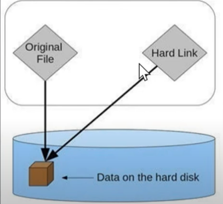
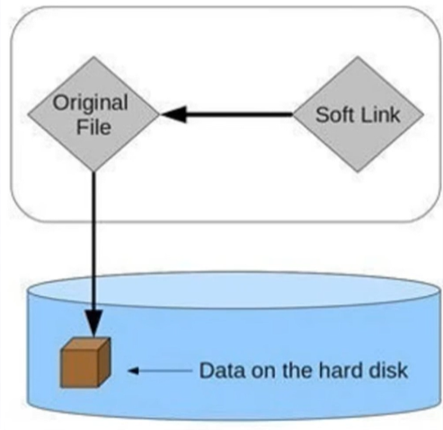

Kv# Nội Dung abc

- [Khái niệm filesystem](#filesystem)
- [Khái niệm inode và metadata](#inode-và-metadata)
- [Link_Hardlink_Symboliclink](#link---hardlink---symbolic-link)
- [Tổng quan filesystem ext4 và 4 đặc điểm chính:](#ext4)
  - [Large filesystem](#1-large-file-system)
  - [extent](#2-extents)
  - [journaling](#3-journaling)
  - [delayed allocation](#4-delayed-allocation)

## Filesystem

 Trong Linux, filesystem là hệ thống tổ chức và quản lý dữ liệu trên thiết bị lưu trữ 
(HDD, SSD, USB, phân vùng...). Nó quy định cách lưu trữ, đặt tên, phân quyền và truy xuất file/thư mục, tức là cung cấp cấu trúc logic để quản lý dữ liệu.

❓ Tại sao phải có file system

- Nếu không có filesystem: ổ đĩa chỉ là dãy bit 0/1 nối tiếp, không có khái niệm file/thư mục. 
Muốn đọc lại, phải biết trước offset (vị trí bắt đầu của dữ liệu) và độ dài dữ liệu.

- Nếu có filesystem: các bit 0/1 được tổ chức có ý nghĩa, OS biết đâu là file, thư mục, 
kích thước, quyền... → giúp thao tác dễ dàng mà không cần nhớ vị trí vật lý dữ liệu.

- Khi ổ đĩa, phân vùng được format với một file system thì toàn bộ dung lượng sẽ được chia thành các block - đơn vị cơ bản để lưu trữ và quản lí dữ liệu.

## inode và metadata
  
**❓ Tại sao phải tìm hiểu inode và metadata**


- Filesystem là lớp phần mềm quản lý cách dữ liệu được lưu trữ và truy cập trên ổ đĩa. Nó phải biết:

    - File nào đang tồn tại.

    - File đó nằm ở đâu trên đĩa.

    - Quyền truy cập, kích thước, thời gian tạo/chỉnh sửa...

=> Muốn làm được điều này, nó cần một cách mô tả dữ liệu (metadata) và một cấu trúc để trỏ tới dữ liệu thật (inode + data block).

**Inode & metadata**

- Inode là một cấu trúc dữ liệu trong filesystem kiểu Linux, dùng để quản lý metadata và vị trí dữ liệu của file, nhưng không lưu tên file và dữ liệu của file.

- Các thông tin mà inode lưu trữ về file chính là metadata.

- Mỗi file/bản ghi thư mục mặc định có 1 inode riêng.

- Tên file không nằm trong inode, mà nằm trong directory entry, trỏ tới inode.

- Ý nghĩa: inode là “bản đồ” của file trong filesystem biết file là gì, ai sở hữu, quyền gì, và file nằm ở đâu trên đĩa, những thông tin này chính là ***metadata*** có trong inode ! 

| Nội dung chính của metadata     | Giải thích                                     |
|------------------------------|-----------------------------------------------|
| ``Loại file``                    | Thường, thư mục, symbolic link, thiết bị, v.v. |
| ``Quyền truy cập ``              | Ai được đọc/ghi/thực thi file                |
| ``Chủ sở hữu ``                   | UID và GID                                   |
| ``Kích thước file``              | Số byte dữ liệu                               |
| ``Thời gian``                     | Tạo, sửa, truy cập lần cuối                  |


- Xem ***inode*** của file 

```
ngocduc@linux:~$ ls -i filename
```

```
ngocduc@linux:~$ ls -i file_new
263310 file_new
```

- Xem ***metadata*** của file:

```
ngocduc@linux:~$ stat filename
```

```
ngocduc@linux:~$ stat file_new
  File: file_new
  Size: 0               Blocks: 0          IO Block: 4096   regular empty file
Device: 252,0   Inode: 263310      Links: 1
Access: (0664/-rw-rw-r--)  Uid: ( 1000/ ngocduc)   Gid: ( 1000/ ngocduc)
Access: 2025-09-19 08:34:56.868231714 +0000
Modify: 2025-09-19 08:34:56.868231714 +0000
Change: 2025-09-19 08:34:56.868231714 +0000
Birth: 2025-09-19 08:34:56.868231714 +0000

```

```
Giải thích các trường:

-Size: 0 → kích thước file là 0 byte (file rỗng).

-Blocks: 0 → file chưa chiếm block vật lý nào (vì 0 byte).

-IO Block: 4096 → kích thước block cơ bản mà filesystem dùng để đọc/ghi (4 KB).

-regular empty file → file thường, không phải thư mục, symbolic link hay thiết bị, và đang rỗng.


-Device: 252,0 → mã thiết bị chứa file (major, minor number).

    -Major number: chỉ loại thiết bị lưu trữ (ví dụ SCSI disk, SSD, LVM. loop device…).
    -Minor number: xác định vị trí/partition/volume mà driver đang quản lý.


-Inode: 263310 → số inode của file, dùng để tham chiếu metadata + block dữ liệu.

-Links: 1 → số hard link trỏ tới inode này. Nếu tạo thêm hard link, số này sẽ tăng.

-Access → lần cuối file được đọc.

-Modify → lần cuối file được sửa nội dung.

-Change → lần cuối inode thay đổi (thường khi thay quyền, owner, hard link).

-Birth → thời điểm tạo file (không phải filesystem nào cũng hỗ trợ).

+0000 : Con số này chỉ múi giờ của thời gian được hiển thị.
```

Tra cứu chi tiết major, minor number : [kernel.org devices.txt](https://www.kernel.org/doc/Documentation/admin-guide/devices.txt?utm_source=chatgpt.com)

>Số lượng inode sẽ phụ thuộc vào kích thước phân vùng, số lượng tối đa sẽ bằng kích thước phân vùng chia 16KB (một inode có kích thước xấp xỉ 16KB)

## Link - hardlink - symbolic link
### Link
- là một cơ chế để tạo một liên kết (tham chiếu) tới một file hoặc thư mục khác, thay vì tạo một bản sao dữ liệu mới. Link giúp tiết kiệm không gian và quản lý file linh hoạt hơn.

- Có 2 loại link chính là **Hardlink** và **Softlink**.

- Tại sao phải dùng link:

  - **Tiết kiệm không gian lưu trữ**: Bằng cách tạo các liên kết, người dùng có thể chia sẻ cùng một dữ liệu giữa nhiều vị trí khác nhau mà không cần sao chép dữ liệu thực sự. Điều này giúp tiết kiệm không gian lưu trữ, đặc biệt là khi có nhu cầu sử dụng nhiều bản sao của cùng một tập tin hoặc thư mục.

  - **Dễ dàng tổ chức dữ liệu**: Sử dụng liên kết, người dùng có thể tổ chức và quản lý dữ liệu một cách linh hoạt. Ví dụ, có thể tạo các liên kết giữa các tập tin và thư mục liên quan chức năng với nhau, giúp việc truy cập dữ liệu trở nên thuận tiện hơn.

### Hard link



- **Hard Link** là một liên kết trực tiếp tới một inode trong hệ thống tệp của Linux. Khi tạo một Hard Link cho một tệp, thực ra đang tạo ra một bản sao trực tiếp của inode, cho phép nhiều tên file trỏ tới cùng một dữ liệu.

- Hard Link chỉ hoạt động với các tệp, không thể tạo liên kết đến thư mục.

- Khi xóa một Hard Link, dữ liệu vẫn tồn tại cho đến khi không có liên kết nào trỏ tới nó nữa.

- Khi thay đổi nội dung của tệp thông qua một Hard Link, thực chất bạn đang thay đổi dữ liệu trong inode mà tất cả các Hard Link trỏ tới. Do đó, bất kỳ thay đổi nào thực hiện sẽ được phản ánh trên tất cả các Hard Link khác cùng trỏ tới inode đó.

- Tất cả các link và hardlink có cùng một inode nếu xóa link này thì còn các link kia và chúng vẫn giữ cùng inode.
    
**Cú pháp tạo hardlink:**

```
ngocduc@linux:~$ ln <file nguồn> <file_hardlink>
```
**Tạo hardlink cho file**

- file1.txt là file gốc
- file1_hardlink là file hardlink

```
ngocduc@linux:~$ ln file1.txt file1_hardlink.txt
ngocduc@linux:~$ ls -li
394635 -rw-rw-r-- 2 ngocduc ngocduc  0 Oct 21 08:36 file1_hardlink.txt
394635 -rw-rw-r-- 2 ngocduc ngocduc  0 Oct 21 08:36 file1.txt
```

**Xóa file1 đi thì hardlink vẫn còn và inode vẫn tồn tại**

```
ngocduc@linux:~$ rm file1.txt
ngocduc@linux:~$ ls -li
total 4
394635 -rw-rw-r-- 1 ngocduc ngocduc 15 Oct 21 08:42 file1_hardlink.txt
394649 -rw-rw-r-- 1 ngocduc ngocduc  0 Oct 21 08:36 file2.txt
```
**Thay đổi dữ liệu thông qua file gốc hoặc hardlink sẽ cập nhật thay đổi đến file còn lại**

```
ngocduc@linux:~$ echo hello >> file1.txt
ngocduc@linux:~$ cat file1.txt
hello
ngocduc@linux:~$ cat file1_hardlink.txt
hello
```
**Hardlink không thể tạo giữa 2 file thuộc 2 phân vùng khác nhau vì giữa chúng có hệ thống inode khác nhau.**

file1 thuộc phân vùng par2  
file2 thuộc phân vùng par3

```
ngocduc@linux:~$ ln /mnt/par2/file1 /mnt/par3/file4
ln: failed to create hard link '/mnt/par3/file4' => '/mnt/par2/file1': Invalid cross-device link
```   

**Khi nào sử dụng hardlink:**

- Khi cần tiết kiệm không gian đĩa và không muốn sao chép dữ liệu thực sự.

- Khi cần truy cập nhanh chóng đến các tệp với nhiều tên khác nhau.

- Lưu trữ hoặc sao lưu dữ liệu một cách hiệu quả, an toàn.

### Symbolic link



- **Symbolic link** (soft link) chỉ lưu đường dẫn (path) của file hoặc thư mục đích, chứ không trực tiếp trỏ tới inode hay block dữ liệu trên đĩa.

**Cú pháp:**

```
ngocduc@linux:~$ ln -s <file gốc> <file trỏ tới file gốc>
```
**Sau khi tạo, khác với hardlink thì file symbolic link không trùng inode với file gốc**

- file2.txt là file gốc
- file2_softlink.txt là file symbolic
```
ngocduc@linux:~$ ln -s file2.txt file2_softlink.txt

ngocduc@linux:~$ ls -li
total 0
394562 lrwxrwxrwx 1 ngocduc ngocduc 9 Oct 21 09:17 file2_softlink.txt -> file2.txt
394649 -rw-rw-r-- 1 ngocduc ngocduc 0 Oct 21 08:36 file2.txt
```

**Thay đổi nội dung file trên file gốc hay file symbolic thì file còn lại sẽ cập nhật nội dung**

```
ngocduc@linux:~$ echo hello >> file2.txt
ngocduc@linux:~$ cat file2_softlink.txt
hello

ngocduc@linux:~$ echo hi >> file2_softlink.txt
ngocduc@linux:~$ cat file2.txt
hello
hi
```
Tạo liên kết trỏ tới một file nằm trong filesystem khác

file5 nằm trong phân vùng /mnt/par2, link5 nằm trong phân vùng /mnt/par3

```
ngocduc@linux:~$ ls -li /mnt/par2
14 -rw-r--r-- 1 root root     0 Oct 24 03:16 file5

ngocduc@linux:~$ ls -li /mnt/par3
14 lrwxrwxrwx 1 root root    15 Oct 24 03:16 link5 -> /mnt/par2/file5
```

**Nếu xóa nhầm file gốc thì file symbolic sẽ hỏng**

```
ngocduc@linux:~$ rm file2.txt
ngocduc@linux:~$ ls -li
total 0
394562 lrwxrwxrwx 1 ngocduc ngocduc 9 Oct 21 09:17 file2_softlink.txt -> file2.txt
ngocduc@linux:~$ cat file2_softlink.txt
cat: file2_softlink.txt: No such file or directory
```


⚠️ **Lưu ý:**

- Symbolic Link cho phép tạo liên kết tới các tệp và thư mục ở các vị trí khác nhau trong hệ thống tệp.

- Có thể dễ dàng tạo, xóa hoặc di chuyển Symbolic Link mà không làm ảnh hưởng đến tệp gốc.

- Symbolic Link có thể trỏ tới các tệp và thư mục trên các ổ đĩa khác nhau.

- Khi tệp hoặc thư mục gốc bị xóa, Symbolic Link sẽ hỏng.

**Khi nào sử dụng symbolic link:**

- Khi cần tạo liên kết giữa các tệp và thư mục ở các vị trí khác nhau trong hệ thống tệp.

- Khi cần tạo liên kết giữa các ổ đĩa hoặc phân vùng khác nhau trên hệ thống.

## Ext4

***Khái niệm:***


- ext4 (Fourth Extended Filesystem) là hệ thống tập tin (filesystem) phổ biến trên Linux, kế thừa từ ext3.

- Nó được thiết kế để lưu trữ và quản lý file/dữ liệu trên ổ đĩa một cách hiệu quả (extent & delayed allocation => giảm phân mảnh), an toàn (journaling) và hỗ trợ các file lớn.

## Feature

### **1. Large file system**


- Trong ext4, block là đơn vị nhỏ nhất để lưu trữ dữ liệu. Một file được chia thành nhiều block nếu nó lớn hơn block size. Nhờ thiết kế này, ext4 có thể quản lý file và filesystem dung lượng lớn:

    - Kích thước **file** tối đa mà ext4 có thể lưu: **16 TB** (với block size chuẩn 4 KB). Tức là file được lưu trong ext4 không được vượt quá 16 TB, ngoài ra vẫn có thể chứa được nhiều file như vậy tùy vào dung lượng trống.

    - Kích thước tối đa mà một **phân vùng/ổ đĩa** có thể format ext4:  **1 EB**.

- Giới hạn file và ổ đĩa/phân vùng sẽ tăng khi chọn block size lớn hơn, cho phép lưu trữ dữ liệu khổng lồ mà vẫn duy trì hiệu quả quản lý.

⚠️ Lưu ý: 
- Block trong ext4 có thể thay đổi thường là 1 KB, 2 KB, 4 KB (mặc định), 8 KB.

- Block càng lớn → file và filesystem tối đa càng lớn, nhưng lãng phí cho file nhỏ nhiều hơn.

- Tuy nhiên, không thể thay đổi block size sau khi format.

Format là quá trình quy hoạch chia thành các block lưu trữ để hệ điều hành có thể quản lý, lưu trữ và truy xuất dữ liệu.


❓**Tại sao lại có giới hạn về kích thước của một file đơn lẻ**


- Trong ext4, dữ liệu file được lưu dưới dạng các extent — mỗi extent là một dải các block liên tiếp trên đĩa.

- Một file lớn cần nhiều extent hơn để mô tả toàn bộ dữ liệu.

- inode của ext4 chỉ có thể lưu tối đa 4 extent trực tiếp. Nếu file có nhiều hơn, hệ thống sẽ dùng cấu trúc "extent tree" để mở rộng, giúp quản lý hàng nghìn hoặc hàng triệu extent.

- Tuy nhiên, cây extent này cũng có độ sâu và số node tối đa (do giới hạn của cấu trúc dữ liệu và kích thước block).

→ Vì vậy, khi file quá lớn đến mức cây extent không thể biểu diễn thêm extent mới, đó chính là giới hạn tối đa kích thước của một file đơn lẻ trong ext4.


❓**Tại sao lại có giới hạn về kích thước của một ổ đĩa hoặc phân vùng mà mount vào ext4**


- Mỗi block sẽ có một block number riêng để file system biết block đó thuộc về file nào.
- Thường block number sẽ có 48 bit dẫn đến số lượng block number sẽ là 2^48.
- Mà kích thước tiêu chuẩn là 4KB => 4 x 2^48


**Xem block number**

```
ngocduc@linux:~$ sudo filefrag -v /mnt/par/file_new
Filesystem type is: ef53
File size of /mnt/par/file_new is 14 (1 block of 4096 bytes)
 ext:     logical_offset:        physical_offset: length:   expected: flags:
   0:        0..       0:    1629223..   1629223:      1:             last,eof
/mnt/par/file_new: 1 extent found
```

**physical offset chính là block number**

### 2. Extents


- Ext4 quản lý file theo extent: một extent là một dải liên tiếp các block trên đĩa.  

- Thay vì phải lưu từng block riêng lẻ như ext2/ext3, ext4 chỉ cần lưu thông tin về cả đoạn block liền mạch.  

    - Đối với **ext2, ext3:**  
File A = block 100, block 101, block 102, block 500, block 501, ...
→ file lớn sẽ cần hàng chục nghìn entry để mô tả.  


    - Đối với **ext4:**  
File A = từ block 100 đến block 32.999  → chỉ cần 1 extent để mô tả cả đoạn dữ liệu liên tục.  
File A: block 100 → 200 liên tiếp
Extent: start=100, length=101 blocks  
=> giảm phân mảnh file


**Xem extent của một file**
```
sudo filefrag -v /path/to/file
```

```
ngocduc@linux:~$ sudo filefrag -v /mnt/par/file_new
Filesystem type is: ef53
File size of /mnt/par/file_new is 14 (1 block of 4096 bytes)
 ext:     logical_offset:        physical_offset: length:   expected: flags:
   0:        0..       0:    1629223..   1629223:      1:             last,eof
/mnt/par/file_new: 1 extent found
```

**Phân mảnh**


Phân mảnh (fragmentation) trong lưu trữ là hiện tượng một file hoặc dữ liệu không được ghi vào một vùng nhớ liên tục, mà bị chia nhỏ và phân tán vào nhiều vị trí khác nhau trên ổ đĩa hoặc bộ nhớ.


**Phân mảnh trong**


Phân mảnh bên trong xảy ra khi bộ nhớ được chia thành các khối có kích thước cố định. Mỗi khi một tiến trình (method) yêu cầu cấp phát bộ nhớ, thì một khối có kích thước cố định sẽ được cấp cho tiến trình đó. Trong trường hợp dung lượng của khối cấp phát lớn hơn dung lượng mà tiến trình thực sự cần, thì phần chênh lệch giữa bộ nhớ được cấp phát và bộ nhớ yêu cầu được gọi là phân mảnh bên trong. Chúng ta cố định kích thước của các khối bộ nhớ, và điều đó gây ra vấn đề này. Nếu dùng kỹ thuật phân vùng động để cấp phát không gian cho tiến trình, thì vấn đề này có thể được giải quyết.


**Phân mảnh ngoài** 


Phân mảnh ngoài xảy ra khi tổng dung lượng bộ nhớ trống đủ để cấp cho tiến trình, nhưng các khoảng trống đó bị chia nhỏ, rải rác, không liền kề nhau. Vì tiến trình thường cần một vùng liên tục, hệ điều hành không cấp phát được.


### 3. Journaling

**Cách mà hệ thống lưu file trước khi có journaling**


Quy trình ghi file (non-journaling filesystem)

Giả sử bạn tạo file report.txt với nội dung "Hello" trong ext2: (lúc này cả inode và dữ liệu được lưu vào page cache trước)

1. Ứng dụng yêu cầu hệ điều hành ghi dữ liệu xuống file  
Khi lưu file, hệ điều hành sẽ nhận yêu cầu này và bắt đầu xử lý.
Dữ liệu "Hello" được sao chép vào bộ nhớ đệm của kernel (page cache) để chuẩn bị ghi ra đĩa.

2. Filesystem tìm block trống  
Filesystem (ext2) tìm một hoặc nhiều block trống trên đĩa để chứa dữ liệu.
Ví dụ chọn block#100.

3. Xin cấp phát block trống

4. Cập nhật metadata (inode)  
Filesystem sửa inode của file: Kích thước file = 5 bytes, File report.txt trỏ tới block #100. Đồng thời cập nhật thư mục cha: ánh xạ tên "report.txt" → inode số X.

5. Đẩy xuống đĩa  
Các thay đổi metadata và data block sẽ được flush xuống đĩa theo thuật toán của OS, và 1 trong 2 sẽ được đẩy xuống đĩa trước. Chính vì nguyên nhân này mà nếu trong trường hợp xảy ra crash thì sẽ gặp vấn đề không đồng bộ sẽ được mô tả dưới đây.


⚠️ Vấn đề nếu có crash


**Trường hợp 1:** Ghi metadata trước, data chưa kịp ghi → inode chỉ tới block rỗng/rác. File xuất hiện nhưng nội dung hỏng.

```
- Dữ liệu mà user nhập được ghi vào page cache (RAM), chưa xuống đĩa.

- Filesystem đã cập nhật metadata (inode): kích thước file, block trỏ tới dữ liệu… và flush inode xuống đĩa.

- Crash xảy ra trước khi dữ liệu trong cache được ghi xuống block thực tế.

- Kết quả: inode đã “chuẩn” (có size, có block) nhưng block chứa dữ liệu vẫn rỗng hoặc rác cũ.

- Vì vậy, file tồn tại nhưng nội dung hỏng. Metadata và dữ liệu thực tế không khớp nhau.

```

**Trường hợp 2:** Ghi data xong nhưng chưa update metadata đầy đủ → dữ liệu không khớp giữa metadata và dữ liệu trên đĩa.

```
- Dữ liệu mà user nhập được ghi vào page cache, sau đó được flush xuống block trên đĩa.

- Block#100 trên disk đã chứa "Hello".

- Metadata (inode) đang được ghi xuống đĩa thì xảy ra crash.

- Một phần nội dung inode có thể đã được ghi, phần còn lại chưa, khiến inode trên đĩa bị hỏng hoặc không đồng nhất với dữ liệu thực tế.

- Kết quả: file bị lỗi.
```

**Khái niệm: journaling**


- Journaling File System là cơ chế trong hệ thống quản lý tệp, cho phép ghi lại nhật ký (journal) của các thay đổi metadata (và đôi khi cả dữ liệu) trước khi áp dụng trực tiếp lên vùng dữ liệu chính.

- Cơ chế này giúp:

    - Đảm bảo tính nhất quán (consistency) và đồng bộ trạng thái của hệ thống tệp,

    - Giảm thiểu nguy cơ hỏng cấu trúc filesystem khi mất điện, treo máy hoặc lỗi ghi,

    - Cho phép khôi phục nhanh về trạng thái ổn định gần nhất bằng cách đọc lại hoặc bỏ qua các thay đổi đã lưu trong journal.

    - Mục tiêu của journaling không phải là ngăn mất dữ liệu người dùng hoàn toàn, mà là đảm bảo hệ thống tệp luôn ở trạng thái nhất quán (consistent), tránh hư hại cấu trúc khi có sự cố.


**Nguyên lý hoạt động:**

```
Journaling không lưu trữ toàn bộ file, mà chỉ ghi lại những thay đổi sắp diễn ra. Nguyên tắc cơ bản:

Khi người dùng thực hiện thay đổi (ví dụ thêm, sửa hoặc xóa file), thông tin thay đổi được ghi trước vào vùng journal.
Nếu quá trình hoàn tất thành công, hệ thống đánh dấu “commit” và thay đổi chính thức áp dụng.
Nếu máy tính tắt đột ngột, hệ thống có thể đọc lại journal để khôi phục trạng thái gần nhất, tránh hỏng file.
```

❓**Khi nào thì ext4 quyết định ghi vào journal**

- việc ext4 quyết định đẩy dữ liệu từ cache vào journal phụ thuộc vào nhiều tham số như dirty_ratio, dirty_background_ratio, dirty_writeback_centisecs, dirty_expire_centisecs, vm.dirtytime_expire_seconds,.. Nhưng chung quy lại sẽ quy về 2 điều dưới đây:  
- **Khi đủ lớn:**

-Khi ghi file liên tục:
  Gom các thay đổi (metadata + data) vào RAM.
  Khi lượng thay đổi đạt đến ngưỡng hoặc không còn chỗ trong transaction hiện tại
➜ đẩy toàn bộ transaction đó vào journal và bắt đầu transaction mới.


- **Khi hết thời gian chờ:**  

Linux có bộ đếm thời gian đồng bộ (commit interval) — mặc định khoảng 5 giây.
Dù transaction chưa đầy, nếu hết 5 giây mà vẫn còn dữ liệu chưa ghi, ext4 sẽ:
➜ ép ghi transaction hiện tại vào journal để đảm bảo không giữ dữ liệu quá lâu trong RAM.
Cơ chế này giúp tránh mất dữ liệu quá nhiều nếu mất điện: bạn chỉ mất tối đa khoảng 5 giây dữ liệu mới nhất.


**Transaction:** Là một nhóm thay đổi mà filesystem muốn thực hiện: Ghi nội dung file (data block),tạo inode cho file,


**Cơ chế mặc định data=ordered mô tả như sau:**


1. Ứng dụng ghi dữ liệu:

Dữ liệu (data) được ghi vào cache trong RAM.

Metadata (inode, block bitmap…) được cập nhật trong cache.

2. Flush data trước:

Kernel ép data trong page cache phải được ghi xuống block dữ liệu thật trên disk.

Đảm bảo block đã chứa data hợp lệ trước khi metadata trỏ đến nó.

3. Ghi metadata vào journal:

Các thay đổi metadata trong cache được ghi xuống journal area (log).

Khi toàn bộ metadata log đã được ghi, transaction được coi là commit.

4. Ghi metadata thật ra disk chính:

Sau commit, metadata trong cache (inode, bảng block…) mới được flush ra disk chính (filesystem area).

Nếu chưa kịp flush mà crash → khi reboot, kernel sẽ dùng journal để replay và ghi lại metadata.

> journal chính là một vùng lưu trữ nằm trên phân vùng của filesystem đó    

### Tình huống xảy ra sau khi đã có order journaling


Ghi "abc" vào file test.txt (file ban đầu trống).

Trình tự xảy ra:

1. User write() → dữ liệu “abc” được ghi vào page cache (RAM).
→ Chưa có gì trên đĩa, chỉ trong RAM.

2. Kernel (ext4) sẽ flush dữ liệu xuống đĩa thật
→ Ghi "abc" vào data block thật (vùng lưu dữ liệu file).
→ Nhưng inode (metadata) vẫn còn trong bộ nhớ, chưa cập nhật xuống đĩa.

3. Chuẩn bị transaction metadata (inode, block mapping, timestamp, v.v.)
→ Ghi metadata đó vào journal.

4. Ghi commit để đánh dấu toàn bộ transaction đã được đẩy vào journal.

⚡ Giờ nếu tắt máy (crash) ở các giai đoạn khác nhau:  
**Trường hợp 1:** Crash trước khi commit

```
Dữ liệu "abc" đã được ghi xuống đĩa thật 

Nhưng metadata (inode) chưa được commit vào journal 

Khi hệ thống khởi động lại:

Journal chưa có transaction hoàn chỉnh, chưa commit → toàn bộ metadata chưa hoàn chỉnh này trong journal sẽ bị bỏ qua.

Inode cũ vẫn nói file size = 0, không trỏ tới block chứa "abc".

Block "abc" đó tuy tồn tại trên đĩa, nhưng không có metadata nào trỏ tới nó → filesystem coi như không thuộc về file nào.

=> File trông “trống”, vì theo metadata, nó vẫn có kích thước 0 và ban đầu chưa trỏ vào block nào cả.
Nhưng dữ liệu "abc" vẫn nằm đâu đó trên đĩa — chỉ là không được “tham chiếu”.

=>File không mất tính nhất quán (inode khớp với dữ liệu mà nó biết), nhưng dữ liệu mới chưa được chính thức ghi nhận.
```
**Trường hợp 2:** Crash sau khi commit
```
Journal đã có metadata mới (size, mapping block,...) và đã commit thành công.

Khi khôi phục, journal sẽ replay metadata.

Inode trỏ đúng tới block có "abc".

File xuất hiện đầy đủ "abc".

File chính xác và an toàn.
```

### 4. delayed allocation

**Khái niệm**


- Delayed Allocation là cơ chế trì hoãn việc cấp phát block trong quá trình ghi file.

- Thay vì cấp block ngay khi ứng dụng đẩy data vào cache, ext4 chờ đến khi dữ liệu thực sự được ghi xuống đĩa (flush) mới cấp phát block vật lý.


**Nguyên nhân ra đời**


- Các file system cũ như ext2/ext3 cấp phát block trống ngay sau khi đẩy dữ liệu vào cache, tức là khi dữ liệu chưa thực sự được flush vào ổ đĩa thì nó đã yêu cầu cấp phát block rồi.

- Các block được cấp có thể không liên tục.

- Trong trường hợp khi ghi cùng một file nhiều lần thì hệ thống sẽ cấp nhiều block mới với vị trí khác nhau dẫn đến phân mảnh file.


>Phân mảnh file tức là dữ liệu trong cùng một file nhưng lại nằm dải rác ở nhiều vị trí không liền kề. Điều này gây ra:  
a. giảm hiệu năng truy suất đĩa do khi file nằm rải rác thì dầu đọc phải nhảy qua nhiều vị trí.  
b. gây độ trễ khi truy cập dữ liệu.

- ***Ví dụ:***  echo 3 lần liên tục vào cùng một file  
 echo a >> BangChuCai  
 echo b >> BangChuCai  
 echo c >> BangChuCai  

Đối với **ext2** chưa hỗ trợ delayed allocation, lúc này sau mỗi lần echo dữ liệu mới được đẩy vào cache thôi chưa được đẩy vào disk, nhưng nó đã yêu cầu cấp block rồi. Lúc này sau 3 lần thì nó yêu cầu 3 block khác nhau và có thể không liên tục dẫn đến cùng một file nhưng bị phân mảnh.

Đối với **ext4**, nó sẽ đợi cả 3 lần echo xong mới xin cấp phát block, nó sẽ tính toán xem cần bao nhiêu và cấp phát bấy nhiêu block liên tục.

**Nguyên lí hoạt động** 

```
Ứng dụng gọi write() → dữ liệu ghi vào page cache (RAM), chưa cấp block.

Hệ thống theo dõi kích thước dữ liệu đang chờ flush.

Khi flush xảy ra (do cache đầy hoặc hết thời gian chờ):

Filesystem mới tính toán kích thước thực cần ghi.

Cấp phát vùng block vật lý lớn, liền kề trên đĩa.

Ghi dữ liệu một lần xuống vùng đó.

➡️ Kết quả:

Dữ liệu của file nằm liên tục trên đĩa → giảm phân mảnh.

Giảm số lần ghi nhỏ lẻ → tăng hiệu năng ghi đĩa.
```

>Nếu vùng trống trên đĩa không đủ lớn để cấp một extent duy nhất liền mạch chứa toàn bộ dữ liệu file, 
ext4 sẽ chia file thành nhiều extent nhỏ hơn (mỗi extent là một dải block liên tục).


**Ưu và Nhược**

- Ưu điểm:  
  • Giảm phân mảnh file.  
  • Tăng hiệu năng ghi nhờ gom nhiều thay đổi thành một lần ghi.  
  • Tối ưu bộ nhớ và giảm overhead quản lý block.  

- Nhược điểm:  
  • Dữ liệu chưa được ghi xuống đĩa ngay, nên nếu mất điện đột ngột, dữ liệu mới nhất (trong RAM) có thể mất.  
  • Tuy nhiên, Journaling vẫn đảm bảo không hỏng cấu trúc filesystem.

 