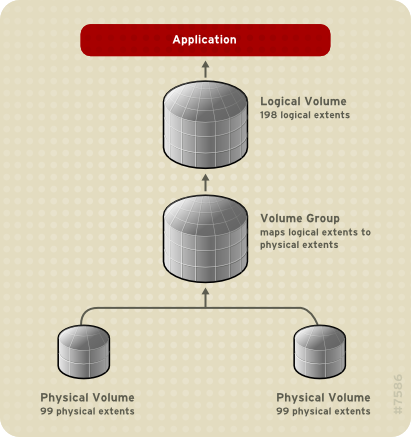
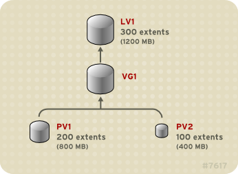
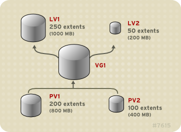
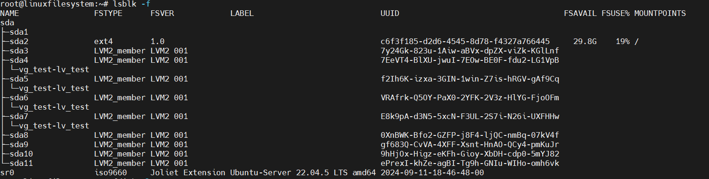

Một linear volume (volume tuyến tính) gộp nhiều physical volume (PV) lại thành một logical volume (LV) duy nhất.
Ví dụ: nếu bạn có hai ổ đĩa 60GB, bạn có thể tạo một logical volume có kích thước 120GB. Về bản chất, không gian lưu trữ vật lý được nối tiếp (concatenated) lại với nhau.

Khi tạo một linear volume, LVM sẽ gán tuần tự một dải các physical extent (PE) cho các logical extent (LE) tương ứng trong logical volume.
Ví dụ: như trong hình “Extent Mapping”, các logical extent 1–99 có thể ánh xạ (map) tới physical volume thứ nhất, và logical extent 100–198 ánh xạ tới physical volume thứ hai.

Từ góc nhìn của hệ điều hành hoặc ứng dụng, logical volume này chỉ là một thiết bị duy nhất có kích thước 198 extent, chứ không biết rằng bên dưới có hai ổ đĩa riêng biệt.



## Figure 2.2. Extent Mapping

Các physical volume (PV) cấu thành nên một logical volume (LV) không nhất thiết phải có cùng kích thước.
Hình 2.3 “Linear Volume với các Physical Volume không bằng nhau” minh họa volume group VG1 có kích thước extent là 4MB.
Nhóm volume này gồm hai physical volume tên PV1 và PV2. Mỗi PV được chia nhỏ thành các đơn vị 4MB (vì đó là kích thước extent).

Trong ví dụ này:

PV1 có 100 extent → tương đương 400MB

PV2 có 200 extent → tương đương 800MB

Như vậy, bạn có thể tạo một linear volume với kích thước bất kỳ từ 1 đến 300 extent (tức là từ 4MB đến 1200MB).
Ví dụ trong hình, linear volume LV1 được tạo với kích thước 300 extent.



## Figure 2.3. Linear Volume with Unequal Physical Volumes


Bạn có thể cấu hình nhiều linear logical volume với kích thước tùy ý từ nguồn physical extent (PE) có sẵn trong volume group.

Hình 2.4 “Multiple Logical Volumes” minh họa cùng một volume group như trong Hình 2.3 (“Linear Volume với các Physical Volume không bằng nhau”), nhưng trong trường hợp này, hai logical volume được tạo ra từ volume group đó:

LV1 có kích thước 250 extent (tương đương 1000MB)

LV2 có kích thước 50 extent (tương đương 200MB)



- Vì cơ chế tuần tự này của LVM nên sẽ có trường hợp xảy ra như sau:

- Giả sử có các PV như sau và từ sda4 đến sda9 đã được add vào vg_test:

```
root@linuxfilesystem:~# pvs
  PV         VG      Fmt  Attr PSize  PFree
  /dev/sda10         lvm2 ---  70.00m 70.00m
  /dev/sda11         lvm2 ---  80.00m 80.00m
  /dev/sda3          lvm2 ---  50.00m 50.00m
  /dev/sda4  vg_test lvm2 a--  48.00m 48.00m
  /dev/sda5  vg_test lvm2 a--  48.00m 48.00m
  /dev/sda6  vg_test lvm2 a--  48.00m 48.00m
  /dev/sda7  vg_test lvm2 a--  48.00m 48.00m
  /dev/sda8  vg_test lvm2 a--  48.00m 48.00m
  /dev/sda9  vg_test lvm2 a--  48.00m 48.00m
```

- Sau đó tạo một LV có kích thước là 148M

```
root@linuxfilesystem:~# lvcreate -L 148M -n lv_test vg_test
  Logical volume "lv_test" created.
```

- Lúc này liệt kê các phân vùng vật lí thì ta sẽ có như sau: 


- Lúc này chỉ thấy sda4 -> sda7 có dòng ``vg_test - lv_test`` mặc dù VG đó có cả sda8, sda9, điều này bởi vì dòng ``vg_test - lv_test`` ám chỉ LV mới tạo này chỉ lấy đủ 148M không gian lần lượt của 4 sda4, sda5, sda6, sda7 thôi.

```
root@linuxfilesystem:~# pvs
  PV         VG      Fmt  Attr PSize  PFree
  /dev/sda10         lvm2 ---  70.00m 70.00m
  /dev/sda11         lvm2 ---  80.00m 80.00m
  /dev/sda3          lvm2 ---  50.00m 50.00m
  /dev/sda4  vg_test lvm2 a--  48.00m     0
  /dev/sda5  vg_test lvm2 a--  48.00m     0
  /dev/sda6  vg_test lvm2 a--  48.00m     0
  /dev/sda7  vg_test lvm2 a--  48.00m 44.00m
  /dev/sda8  vg_test lvm2 a--  48.00m 48.00m
  /dev/sda9  vg_test lvm2 a--  48.00m 48.00m
```
- Như đã thấy lv có kích thước 148M đã chiếm 3 phân vùng đầu của vg_test là sda4, sda5, sda6 và 4M ở sda7, nó đã lấy một cách tuần tự.